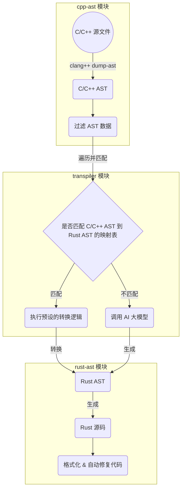

# c2rust: 基于 AST 和 AI 技术的代码转译工具

## 摘要

随着 Rust 语言因其出色的内存安全性和并发处理能力在软件开发领域受到越来越多的青睐，开发者和组织日益寻求将现有的 C/C++ 代码迁移到 Rust。本项目（c2rust）致力于通过自动化的方式准确且高效地转换 C/C++ 项目源码至 Rust 项目源码。传统上，代码转换工作依赖于抽象语法树（AST）进行，这一方法虽稳定但开发难度大。近年来，人工智能（AI）的大模型技术的进步为代码转换提供了新的可能，特别是在处理复杂场景时的灵活性和准确性方面。然而完全依赖 AI 可能会生成不正确的结果。本项目通过结合 AST 的稳定性和 AI 大模型的灵活处理能力，旨在保证准确度的前提下降低代码转换和维护的成本，为开发者和组织提供一个可靠的代码迁移工具。这种融合传统与前沿技术的方法不仅提高了转换的准确率，也显著降低了开发和维护的复杂度，展现了在现代软件工程中应用 AI 技术的创新潜力，以及其与传统工作流相辅相成的开发模式。


## 1. 作品基本信息

### 1.1 软件分类

编程语言转换工具 / 开发工具 / 代码迁移辅助工具


### 1.2 应用领域

* 代码迁移

* 教育学习

* 代码审查和优化


### 1.3 开放源码许可证

MIT


## 2. 作品概述

### 2.1 背景及应用领域

许多现有的软件系统和应用是用 C/C++ 编写的，这些语言虽然强大，但在内存安全和并发处理方面存在挑战。Rust 语言的设计旨在解决这些问题，提供了无需垃圾收集的内存安全保证，以及先进的并发处理能力。因此，将 C/C++ 代码迁移到 Rust 不仅可以提升软件的安全性和性能，还能增强代码的可维护性。通过本项目自动化转换工具，可以简化迁移过程，适用于各种规模的软件项目。


### 2.2 项目特点和设计思路

本项目采取了一种创新的方法，巧妙地将传统的抽象语法树（AST）分析与最新的人工智能（AI）大模型技术相结合，旨在实现代码转换的高准确性和高效率。这种融合策略正是为了在保证转换精度的同时，也提高转换的灵活性和处理速度。


尽管AI大模型技术的发展迅速，不断有新模型推出，但它们普遍存在一个难以避免的问题——倾向于生成“幻觉”[^1]，即可能产生看似合理但实际错误的结果。这种现象在代码转换过程中尤为突出，可能会导致不符合预期的输出，增加后期修正的工作量。


另一方面，基于 AST 的传统代码转换方法虽然在准确性方面表现优异，但需要针对各种可能的编码情况进行详尽的处理，这使得实现过程复杂度较高，难以迅速适应新的或复杂的代码模式。


因此，本项目旨在找到一个平衡点，通过结合 AST 的稳定性和 AI 模型的灵活性，优化代码转换流程。通过这种方式，我们不仅可以利用 AST 分析保证转换过程的准确性，还可以借助 AI 大模型的强大能力处理那些通过传统方法难以应对的复杂场景。这种策略的核心在于利用AI 技术的优势来弥补 AST 方法的不足，同时通过精确的 AST 分析来约束 AI 模型的“幻觉”现象，确保转换结果的可靠性和一致性。通过这种精心设计的融合方法，本项目不仅提高了代码转换的效率和灵活性，也显著降低了实现复杂度，为代码迁移和转换提供了一种更加高效、准确的解决方案。


## 3. 功能描述




C/C++ 到 Rust 源码转译的流程如下：

1. **获取源文件清单**
   利用 C/C++ 的成熟工具链，如 CMake，我们首先自动获取完整工程的源文件清单。这一步骤确保了所有相关的源文件都将被考虑在内，为后续的转换工作奠定基础。

2. **生成抽象语法树（AST）**
   借助 clang 的命令行工具，对每个源文件执行深入分析，生成对应的 AST。这些 AST 通过 json 格式反序列化，转化为 Rust 中可操作的数据结构，为转换过程做准备。

3. **清洗 AST 数据**
   在转换前，对 AST 数据进行必要的清洗，去除编译器特有的、对转换无直接帮助的信息，如行列号等。同时，识别并标记由 C/C++ 标准库引入的 AST 部分，重点专注于用户代码相关的 AST 节点。

4. **定义 Rust AST 数据结构**
   在 Rust 端定义一个精简版的 AST 数据结构，忽略非核心的信息，例如行列号。该数据结构设计以兼容 quote[^2] 库，目的是为了在后续生成格式化的 Rust 源码。

5. **AST 转换逻辑**
   通过遍历 C/C++ 的 AST 节点，并根据节点类型应用相应的转换逻辑，逐步构建 Rust 的 AST。对于复杂或深层嵌套的节点，借助 AI 大模型完成转换，生成的 AST 部分将被特别标记，并携带额外的类型信息，以便后续转换时能应用正确的处理逻辑。需要特别说明的是，C/C++ 中可能会调用标准库中的函数，在对函数定义语句进行转换时，需要对函数签名进行匹配，若命中预先定义的映射表，则将其转换成 Rust 中对应的函数。如果没有命中但又是标准库中的函数，则需要利用 AI 来完成转换。

6. **映射与校正**
   考虑到 C/C++ AST 与 Rust AST 之间不存在完全对等的关系，加之 Rust 独有的语言特性（如所有权机制），转换过程中需要不断地校正已转换的 Rust AST。为此，建立转换前与转换后两个节点的映射关系，保持对每个转换步骤的上下文信息，以确保能够进行必要的调整。

7. **生成 Rust 源码**
   利用 `quote` 库和转换得到的 Rust AST，生成 Rust 源码。随后，通过代码格式化工具和正确性检查工具，确保转换结果的质量和正确性。


## 4. 模块设计

本项目包含 3 个主要模块，每个模块针对代码转换流程的一个关键阶段执行特定任务：

1. `cpp-ast` : 负责与 C/C++ 的工具链交互，生成完整的 json 格式的 C/C++ 抽象语法树，并反序列化成 Rust 的 struct. 标记标准库 AST 和用户代码对应的 AST，清理无关字段。

2. `rust-ast`: 定义了一个简化版的 Rust AST 结构，以适应转换需求。现阶段省略了 Rust 语言中的泛型等复杂机制，聚焦于核心结构如函数定义、复合语句、表达式等。这里的每一个 Rust AST 节点都实现了 `quote` 库的 `ToTotokens` trait, 以便能够直接转换为对应的 rust 源码。

3. `transpiler`: 核心转换逻辑。将 C/C++ 的 AST 节点映射并转换为 Rust 的 AST 节点。该模块维护两个个内置的映射表，一套用于处理常见的、直接映射的节点类型，另一套用于特殊逻辑，如将 C/C++ 的原生指针映射为 Rust 中的 `Box`。
   
   除此之外，在进行转换时，它也建立并维护 C/C++ AST 至 Rust AST 的映射关系，以及当前正在处理的节点的上下文信息，进而细化处理逻辑。例如，一个 C/C++ 原生指针在定义时会在 Rust 中相应的映射为 `Box` 指针，但作为参数时，则作为引用来进行传递。
   
   如果当前处理的节点类型均不在这两张表里，则会调用 AI 来处理。AI 接收当前节点以及其所有子节点的数据，让其直接生成对应语句或者表达式的 token。在 Rust AST 转换成对应 Rust 代码时无需关心其内部具体细节。
   
   

## 5. 体系结构和关键技术点

### 5. 1 体系结构

1. 源码解析器：利用 clang 等 C/C++ 工具链解析代码并生成对应的抽象语法树。

2. AST 转换器：利用预设的规则对成功匹配的节点类型进行转换，处理语言上的差异。

3. AI 辅助模块：利用 AI 大模型来处理复杂的情况。

4. 代码生成器：利用转换好的 Rust AST 生成相应的 Rust 源代码。

5. 转换规则和映射库：尽可能囊括所有一般情况和特殊情况的映射关系，保证 AST 转换的逻辑正确无误。

### 5.2 关键技术点

1. 语法 & 语义的分析：深入理解两种语言的语法差异和语义规则是此项目的核心。不仅需要准确解析 C/C++ 代码，还要理解如 Rust 的所有权、借用等独特语义。

2. AI 的稳定性和准确性：尽可能通过 prompt engineering 来减少 AI 幻觉的概率。


## 6. 验收标准

1. 编译器能通过编译。

2. 给定同样的测试用例，原 C/C++ 代码的执行结果与生成的 Rust 代码的执行结果一致。


## 7. 部署及使用方法

### 7.1 先决条件

本项目主要由 Rust 编写，但由于使用了本地部署的开源大模型 [OpenCodeInterpreter](https://github.com/OpenCodeInterpreter/OpenCodeInterpreter)，需要事先安装 [Rust](https://www.rust-lang.org/tools/install) 和 [Python](https://www.python.org/downloads/) 环境，以及一个能访问 [Hugging Face](https://huggingface.co/) 的网络，还有一个显存 ≥ 16GB 的 GPU。


对于 Python，推荐进一步地使用 [miniconda]([Installing Miniconda &#8212; Anaconda documentation](https://docs.anaconda.com/free/miniconda/miniconda-install/)) 来管理虚拟环境。

推荐使用 Linux 操作系统。以下部署方式均基于 Linux 以及 `miniconda`.


### 7.2 clang 安装

取决于发行版，debian 系请执行：`sudo apt install clang`.

其他发行版请使用对应的包管理工具进行安装，或在 [官方页面](https://releases.llvm.org/download.html) 下载并根据文档从源码编译安装，并保证 `clang++` 所在目录在 `PATH` 的环境变量中。


### 7.3 Python 虚拟环境准备

执行下列命令创建一个新的虚拟环境：

```shell
conda create -n c2rust python=3.9
```


克隆本项目：

```shell
git clone https://atomgit.com/vivoblueos/000029-AWaLong c2rust
```


激活这个虚拟环境并安装依赖：

```shell
conda activate c2rust
cd c2rust/llm
python3 -m pip install -r requirements.txt
```


运行大模型服务：

```shell
./run.sh
```


新开一个终端，进入 `c2rust` 工程下，执行：

```shell
cargo run --release -- /path/to/source.cpp
```

其中 `/path/to/source.cpp` 需要替换成实际要转译的 C/C++ 代码的真实路径。如果执行成功，终端将输出转换后的 Rust 代码。


## 8. 后续优化

目前在转换流程上还有很多工作亟待完成和优化：

1. 实现更灵活的映射方案：
   
   当前，对于 C/C++ 标准库函数到 Rust 标准库函数的映射采用的是硬编码规则，这限制了转换的灵活性和扩展性。未来，我们将探索以下几个方向：
   
   i. **插件系统**：提供公共 API，实现一个插件系统，允许用户和开发者为特定的库或框架创建和分享自定义的映射规则。
   
   ii. **非编程映射定义**：允许使用 json 或其他标记语言来定义映射规则，使得非开发专业人士也能轻松参与到映射规则的制定中。

2. AI 模型优化：
   
   目前使用的开源模型 [OpenCodeInterpreter](https://github.com/OpenCodeInterpreter/OpenCodeInterpreter) 虽然已经针对编程相关的问题进行了优化，但目前并没有任何针对 AST 转换进行过特别优化的模型。如果能够训练或以微调的方式对 AST 转换特殊处理，应该可以进一步提高准确率。

3. 自动化地处理转换后可能出现的编译问题：
   
   由于 Rust 编译器严格的检查机制，可能会揭示原 C/C++ 代码中未暴露的问题，这将会导致生成的 Rust 代码编译失败。对于少量的文件可以手动进行更正。但如果是较大的项目手动修正就难以接受了。为了应对这一挑战，我们可能还会利用 AI 的能力，让其根据源码以及错误信息尝试进行修正。

4. 交互的优化：提供更加用户友好的 GUI 或 web 页面来降低工具的使用难度。


[^1]: [Hallucination (artificial intelligence) - Wikipedia](https://en.wikipedia.org/wiki/Hallucination_(artificial_intelligence))

[^2]: 一个在实现 rust 派生宏时经常用到的库，用其自定义的语法来将特定结构转为 Token，进而生成 rust 代码。
